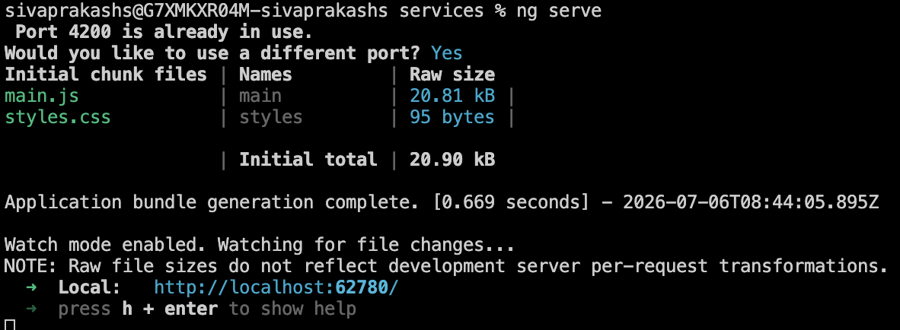

# Angular Weather Application

## Project Description
This project is a responsive Angular weather dashboard that fetches forecast data from:

https://sampleapi20260706g3-bvdacte9b0dvhudv.canadacentral-01.azurewebsites.net/Weatherforecast

It includes:
- a single weather component (`weather`)
- `weather.service.ts` for API integration via Angular `HttpClient`
- loading and error states
- tabular weather display (Date, Temperature C/F, Summary)
- forecast count, hot-row highlighting (`temperatureC > 30`), and a refresh button

## Angular Version
- Angular CLI: `21.2.13`
- Angular framework: `21.2.x`

## Installation Steps
1. Clone the repository.
2. Install dependencies:

```bash
npm install
```

3. Run locally:

```bash
npm start
```

4. Open:

http://localhost:4200/

## Build Steps
For production build:

```bash
npm run build
```

For GitHub Pages build:

```bash
npm run build -- --base-href /my-angular-app/
```

## Deployment URL
https://sivaprakash1603.github.io/my-angular-app/

## CI/CD (GitHub Actions)
Workflow file:

`.github/workflows/deploy.yml`

Pipeline on push to `main`:
1. Checkout code
2. Setup Node.js
3. Install dependencies
4. Build Angular app with GitHub Pages base href
5. Upload artifact and deploy via GitHub Pages

## Screenshots

### Application Running Locally


### GitHub Actions Successful Run


### Application Running from GitHub Pages

